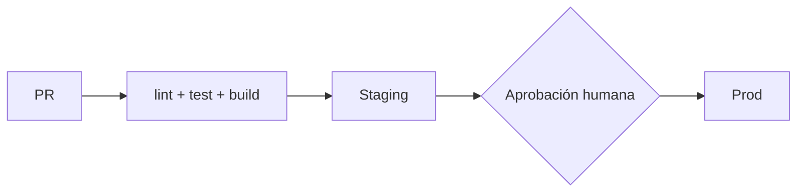

 
# /init — Inicialización de proyecto AI-Driven
 
Prepara un repositorio para trabajar con el flujo:
 
```
/init → /specify → /plan → /tasks → /implement → /review → /release
```
 
Al terminar, el repositorio tiene una fuente de verdad (constitución, arquitectura, specs) que
todos los comandos posteriores leen y respetan.
 
**Versión del paquete de skills:** `1.2.0` (se escribe en `.ai/project.yaml → skills_version`).
 
## Argumentos
 
| Argumento | Efecto |
|---|---|
| `--type <frontend\|backend\|fullstack\|monorepo\|library>` | Omite la pregunta de tipo de proyecto |
| `--force` | Permite sobrescribir archivos existentes (siempre mostrando diff antes) |
| `--no-explore` | En brownfield, omite los subagentes y solo entrevista |
| `--dry-run` | Muestra qué archivos se crearían sin escribirlos |
 
## Reglas generales
 
- **Nunca inventes.** Lo que no se sepa por el código o por el usuario se pregunta o se marca como `TODO(init):`.
- **Nunca sobrescribas en silencio.** Si un archivo existe, sigue la política de la Fase 0.
- **No hagas commit ni push.** El usuario revisa y confirma.
- **Nunca despliegues.** `/init` documenta cómo se despliega; desplegar es trabajo de `/release`,
  y a producción solo con aprobación humana explícita.
- `AGENTS.md` es un **índice corto** (objetivo: < 150 líneas). El detalle vive en `docs/`.
- Todo contenido inferido de código lleva `status: inferred` y requiere revisión humana.
- Escribe los documentos en el idioma que use el usuario.
---
 
## Fase 0 — Detección
 
1. **¿Ya inicializado?** Busca `.ai/project.yaml`, `AGENTS.md`, `docs/constitution.md`.
   - Si existe `.ai/project.yaml`: el proyecto ya fue inicializado. Pregunta si quiere
     **(a)** re-sincronizar (actualizar arquitectura, specs, inventario y `docs/templates/` si
     `skills_version` es anterior, mostrando diff; sin tocar la constitución),
     **(b)** reiniciar con `--force`, o **(c)** cancelar.
   - Si existe `AGENTS.md` o `CLAUDE.md` sin `.ai/project.yaml`: léelos y trátalos como **insumo**
     de la entrevista; al final propone un merge con diff, no un reemplazo.
2. **¿Greenfield o brownfield?** Es brownfield si se cumple **al menos una**:
   - Existe un manifiesto: `package.json`, `pyproject.toml`, `requirements.txt`, `go.mod`,
     `Cargo.toml`, `pom.xml`, `build.gradle*`, `composer.json`, `Gemfile`, `*.csproj`, `pubspec.yaml`.
   - Hay más de ~10 archivos de código fuente fuera de carpetas de configuración.
   - `git rev-list --count HEAD` > 5.
   Si las señales son contradictorias (p. ej. manifiesto vacío, repo con solo un README), pregunta.
3. **Tipo de proyecto** (si no vino `--type`): en brownfield infiérelo y pide confirmación; en
   greenfield pregúntalo. Señales:
   - Frontend: `react`, `vue`, `svelte`, `angular`, `next`, `vite`, carpetas `components/`, `pages/`.
   - Backend: `express`, `fastapi`, `django`, `spring`, `gin`, `nestjs`, carpetas `routes/`, `controllers/`, `migrations/`.
   - Fullstack: señales de ambos en un mismo paquete, o meta-frameworks con servidor (Next con API routes, Remix, Nuxt server, Laravel con vistas).
   - Monorepo: `pnpm-workspace.yaml`, `turbo.json`, `nx.json`, `lerna.json`, `workspaces` en `package.json`, varios manifiestos. En monorepo, registra el tipo **por paquete**.
   - Library: sin punto de entrada de app, con `exports`/`main` publicable o `[project]` sin servidor.
Informa en una línea qué detectaste antes de continuar.
 
---
 
## Fase 1 — Exploración (solo brownfield)
 
Omitir con `--no-explore` o en greenfield.
 
Lanza **en paralelo** cuatro subagentes de solo lectura (tipo `Explore` si existe). Los prompts
exactos están en el **Anexo A**:
 
| Subagente | Produce |
|---|---|
| A. Arquitectura | Capas, módulos, dependencias, flujo de datos, integraciones externas, despliegue |
| B. Dominio y features | Inventario de features con evidencia (rutas, archivos, tests) |
| C. Convenciones | Estilo, naming, estructura, patrones, lint/format, commits |
| D. Tooling, calidad y despliegue | Comandos build/test/lint/dev, CI, cobertura, variables de entorno, pipelines de deploy, entornos, rollback |
 
Cada subagente devuelve un informe estructurado con **evidencia** (rutas de archivo) y un nivel de
confianza (`alta`/`media`/`baja`) por hallazgo. No generan documentos: solo informan.
Si el entorno no permite subagentes, ejecuta las cuatro exploraciones tú mismo en secuencia con
los mismos prompts.
 
Después, **consolida**:
- Unifica el inventario de features (subagente B) y deduplica.
- Lista contradicciones entre informes y lo que no se pudo determinar → pasa a la entrevista.
- Si el inventario tiene más de 15 features, agrúpalas por dominio y pregunta al usuario cuáles
  documentar ahora; el resto queda listado en `docs/specs/README.md` como pendiente.
---
 
## Fase 2 — Entrevista
 
Sigue el **Anexo B**. Principios:
- Pregunta solo lo que **no** sepas. En brownfield, presenta lo inferido y pide confirmación.
- Usa preguntas de opción múltiple cuando sea posible, máximo 4 por ronda, máximo 4 rondas.
- Si el usuario no está disponible (sesión desatendida), toma la opción más conservadora,
  márcala como `TODO(init): confirmar` y continúa.
Bloques obligatorios:
1. Propósito del proyecto y usuarios objetivo.
2. Tipo de proyecto y stack (confirmar o definir).
3. Principios innegociables (proponer un borrador según el tipo; el usuario edita).
4. Estrategia de testing y definición de "terminado".
5. Etapa actual y próximos objetivos (→ roadmap).
6. Despliegue: entornos, plataforma, quién aprueba producción y cómo se revierte
   (→ `docs/deployment.md`). En prototipos sin despliegue aún, registra `deploy.strategy: none`
   y marca la sección como `TODO(init)`.
---
 
## Fase 3 — Generación
 
Genera en este orden, usando las plantillas del **Anexo C** (`templates/<archivo>` = la plantilla
con ese nombre en el anexo). Sustituye cada `{{placeholder}}`; lo que quede sin dato se convierte
en `TODO(init): …`. Elimina las secciones marcadas `<!-- if type=… -->` que no apliquen al tipo.
 
1. `.ai/project.yaml` ← `templates/project.yaml`
2. `docs/constitution.md` ← `templates/constitution.md`
3. `docs/architecture.md` ← `templates/architecture.md`
   - Greenfield: arquitectura **propuesta**, marcada `status: proposed`.
   - Brownfield: arquitectura **observada**, `status: inferred`, con evidencia.
4. `docs/adr/0001-registro-de-decisiones.md` ← `templates/adr.md` (ADR inicial que adopta ADRs).
   En brownfield, crea ADRs adicionales solo para decisiones evidentes (framework, base de datos).
5. `docs/specs/` (solo brownfield):
   - `docs/specs/README.md` con el inventario completo y estado de cada spec.
   - Por cada feature seleccionada: `docs/specs/NNN-<slug>/spec.md` ← `templates/spec.md`,
     con `status: inferred`. Documenta lo que el código **hace**, no lo que debería hacer.
     Discrepancias, bugs aparentes y deuda van en la sección "Observaciones".
6. `docs/deployment.md` ← `templates/deployment.md`
   - Greenfield: `status: proposed` con la estrategia acordada en la entrevista.
   - Brownfield: `status: inferred`, a partir de pipelines, Dockerfiles, IaC y scripts reales.
   - Si no hay procedimiento de rollback conocido, déjalo como `TODO(init)` y repórtalo como
     riesgo en el resumen: es el hueco más peligroso del documento.
7. `docs/roadmap.md` ← `templates/roadmap.md`
8. `docs/templates/` ← copia `templates/spec.md`, `templates/plan.md`, `templates/tasks.md`,
   `templates/review.md` y `templates/adr.md` para que los usen las demás skills.
9. `CHANGELOG.md` ← `templates/CHANGELOG.md` (solo si no existe; si existe, respeta su formato).
10. `AGENTS.md` ← `templates/AGENTS.md` (se escribe al final porque enlaza todo lo anterior).
11. `CLAUDE.md` ← `templates/CLAUDE.md` (si no existe; si existe, añade `@AGENTS.md` al inicio).
### Secciones condicionales por tipo
 
Aplica según `project.type` (en monorepo, por paquete):
 
| Tipo | Arquitectura incluye | Constitución propone | Skills habilitadas |
|---|---|---|---|
| frontend | Componentes, estado, routing, design tokens, accesibilidad | WCAG AA, componentes con tests, sin lógica de negocio en vistas, preview por PR | `design` |
| backend | API (contratos), modelo de datos, migraciones, observabilidad, seguridad | Contrato de API antes de implementar, migraciones reversibles y compatibles con la versión anterior, logs estructurados, health check | — |
| fullstack | Ambas + **contrato entre capas** (tipos compartidos, versionado de API) | Unión de ambas + el contrato es la fuente de verdad entre capas | `design` |
| library | API pública, compatibilidad, versionado semántico | SemVer estricto, API pública documentada y testeada, publicación solo desde CI con tag | — |
 
Las skills no se cargan ni descargan desde aquí: se registran en `.ai/project.yaml → skills.enabled`.
Cada skill condicional debe comprobar ese archivo al activarse (ver "Contrato para otras skills").
 
---
 
## Fase 4 — Verificación
 
1. Ejecuta los comandos declarados en `AGENTS.md` (instalar, lint, test, build) con timeout
   razonable. **No** ejecutes comandos de despliegue, migraciones sobre bases reales ni nada que
   escriba fuera del repo. Registra el resultado en `.ai/project.yaml → verification`.
   Si un comando falla, no lo borres: márcalo con `# ⚠ falló en /init: <motivo breve>`.
2. Comprueba que cada enlace relativo en `AGENTS.md` apunta a un archivo existente.
3. Comprueba que `AGENTS.md` no supera ~150 líneas; si lo hace, mueve detalle a `docs/`.
4. Comprueba que no quedan `{{placeholders}}` sin sustituir (excepto en `docs/templates/`, que
   los conserva a propósito).
---
 
## Fase 5 — Resumen
 
Entrega al usuario, sin recapitular los pasos:
- Lista de archivos creados/modificados.
- Qué requiere revisión humana (todo lo `inferred`, `proposed` y cada `TODO(init)`), con conteo.
- Resultado de la verificación de comandos.
- Estado de `docs/deployment.md`, destacando si falta el procedimiento de rollback.
- Siguiente paso sugerido: revisar y aprobar `docs/constitution.md`, luego `/specify` para la
  primera feature.
---
 
## Contrato para otras skills
 
Los comandos posteriores dependen de lo que `/init` deja. Documenta y respeta:
 
- **Todas** leen `.ai/project.yaml` y `docs/constitution.md` antes de actuar.
- `/specify` crea `docs/specs/NNN-<slug>/spec.md` desde `docs/templates/spec.md`
  (NNN = siguiente número libre, 3 dígitos, nunca reutilizado). Máximo 3
  `[NECESITA ACLARACIÓN]`; con alguno abierto la spec no puede pasar a `approved`.
- Ciclo de vida de una spec: `draft` → `approved` → `implemented` → (review) → `released`
  (`inferred` → `approved` para las creadas por `/init`). Una spec `implemented` o `released` no se
  edita: se crea otra que la extienda.
- `/plan` exige spec `approved`, incluye **Trazabilidad** (criterio → cambio → test) y queda en
  `draft`, `approved` o `blocked`.
- `/plan` y `/tasks` incluyen una sección **Constitution Check**: cada principio con
  ✅ cumple / ➖ no aplica / ❌ viola. Un ❌ solo avanza con aceptación explícita del usuario.
- Una skill condicional (p. ej. `design`) empieza así:
  > Lee `.ai/project.yaml`. Si `design` no está en `skills.enabled`, informa que no aplica a este
  > tipo de proyecto y detente, salvo que el usuario insista.
- `/plan` incluye una sección **Rollout** (flags, orden de migraciones, rollback, métricas).
- `/tasks` exige plan `approved`; numera T001–T089 para el trabajo y reserva T090–T099; cada
  tarea declara archivos, criterio de hecho, `cubre: CA…` y `depende:`; incluye tablas de Cobertura.
- `/implement` exige `tasks.md` `approved`, ejecuta una tarea a la vez, se detiene en T092 y deja
  la spec en `implemented`.
- `/review` exige spec `implemented`, escribe `review.md` con veredicto `approved`,
  `changes_requested` o `blocked`. Con `changes_requested`, añade tareas a `tasks.md` y la spec
  vuelve a `approved` hasta que `/implement` las cierre.
- `/release` lee `docs/deployment.md`, verifica que la spec tenga todas sus tareas cerradas y
  `review.md` con veredicto `approved`, sube versión, actualiza `CHANGELOG.md`, despliega a
  staging y **solo con confirmación explícita del usuario** despliega a producción. Al terminar
  marca la spec como `released` y actualiza el roadmap.
- Cambiar la constitución requiere subir `version` y añadir una entrada en "Enmiendas".
- Una spec `inferred` pasa a `approved` solo con confirmación explícita del usuario.
---
 
# Anexo A — Prompts de los subagentes de exploración
 
Sustituye `{{root}}` por la raíz del repo y `{{type_hint}}` por el tipo detectado en la Fase 0.
Todos son de **solo lectura**: no crean ni modifican archivos y solo ejecutan comandos de
consulta (`ls`, `grep`, `git log`); nunca instalan, compilan ni corren tests.
 
Formato de salida común (inclúyelo literalmente en cada prompt):
 
```
## Hallazgos
- [confianza: alta|media|baja] <hallazgo> — evidencia: <ruta:línea>, <ruta>
## No determinado
- <pregunta concreta para el usuario>
## Contradicciones
- <qué contradice a qué, con rutas>
```
 
Ignorar siempre: `node_modules/`, `vendor/`, `.venv/`, `dist/`, `build/`, `target/`, `.git/`,
archivos generados y lockfiles (salvo para identificar el gestor de paquetes). Nunca leer ni
reportar valores de `.env` reales, llaves o secretos.
 
### A. Arquitectura
 
> Explora el repositorio en `{{root}}` (tipo probable: `{{type_hint}}`) y describe su arquitectura
> **tal como está**, no como debería ser. Reporta:
> 1. Estilo arquitectónico (capas, hexagonal, MVC, feature-folders, microservicios, monolito modular…).
> 2. Módulos/paquetes principales: responsabilidad en una línea y dependencias entre ellos.
> 3. Punto(s) de entrada de la aplicación.
> 4. Flujo de una petición o interacción típica de punta a punta.
> 5. Persistencia: motores, ORM, ubicación de esquemas y migraciones.
> 6. Integraciones externas: APIs, colas, servicios cloud, proveedores de auth.
> 7. Despliegue: Dockerfiles, IaC, configuración de plataforma.
> 8. Si es fullstack/monorepo: cómo se comunican las capas y si hay tipos/contratos compartidos.
> Incluye un diagrama Mermaid (`flowchart`) de componentes. Muestrea archivos representativos;
> no leas todo. Usa el formato de salida indicado.
 
### B. Dominio y features
 
> Explora `{{root}}` y construye un **inventario de funcionalidades** visibles para el usuario o
> consumidor de la API. Para cada una: `slug` kebab-case, nombre, descripción en 1–2 frases,
> evidencia (rutas/endpoints/pantallas, archivos principales, tests que la cubren), entidades de
> dominio involucradas y confianza en que es una feature real (vs. experimento o código muerto).
> Además: lista de entidades de dominio con sus campos clave y un glosario de términos del negocio.
> Fuentes útiles: definiciones de rutas, controladores, páginas, OpenAPI/GraphQL, tests e2e,
> README, changelog. Usa el formato de salida indicado.
 
### C. Convenciones
 
> Explora `{{root}}` e identifica las convenciones **realmente usadas** (no solo configuradas):
> naming de archivos/funciones/clases/componentes; estructura de carpetas y dónde va cada cosa;
> patrones recurrentes (errores, validación, inyección de dependencias, estado); configuración de
> lint/format y reglas notables; estilo de commits (`git log --oneline -30`) y ramas; idioma del
> código, comentarios y docs. Señala dónde el código contradice la configuración declarada.
> Usa el formato de salida indicado.
 
### D. Tooling, calidad y despliegue
 
> Explora `{{root}}` y reporta cómo se construye, prueba y ejecuta: gestor de paquetes y versión de
> runtime (`.nvmrc`, `.python-version`, `engines`, toolchain); comandos exactos para instalar,
> desarrollo local, build, test (unit/integración/e2e), lint, format y type-check, tomados de
> `scripts`, `Makefile`, `justfile`, `tox.ini`, etc.; frameworks de testing, ubicación de tests y
> cobertura aproximada; CI/CD (archivos, jobs, disparadores); variables de entorno requeridas
> (solo nombres, desde `.env.example`, config o código).
> Despliegue: entornos existentes (dev/staging/prod), plataforma (Vercel, Fly, AWS, K8s, etc.),
> cómo se dispara cada deploy (push a rama, tag, manual), aprobaciones configuradas, estrategia
> (rolling, blue-green, canary), cómo se aplican las migraciones, procedimiento de rollback si
> existe, health checks y dónde están logs y métricas. Si no encuentras rollback, dilo
> explícitamente en "No determinado". **No ejecutes** comandos.
> Usa el formato de salida indicado.
 
---
 
# Anexo B — Guía de entrevista
 
Máximo 4 rondas de hasta 4 preguntas. Opción múltiple siempre que se pueda; el usuario siempre
puede escribir su propia respuesta. En brownfield, cada pregunta arranca con lo inferido
("Detecté X — ¿correcto?").
 
**Ronda 1 — Identidad**
1. ¿Qué problema resuelve el proyecto y para quién? (texto libre, 1–3 frases)
2. Tipo: frontend · backend · fullstack · monorepo · library.
3. Stack (greenfield: proponer 2–3 opciones coherentes con el tipo; brownfield: confirmar).
4. Etapa: prototipo · MVP · producción · mantenimiento.
**Ronda 2 — Reglas**
1. Principios innegociables: presenta el borrador según tipo (tabla de la Fase 3) más los
   universales de abajo; el usuario marca cuáles conservar y añade los suyos.
2. Testing: TDD obligatorio · tests por feature antes de merge · solo críticos · por definir.
3. Definición de terminado: tests pasan · lint limpio · docs actualizadas · revisión humana (multi).
4. Restricciones: compliance (GDPR, HIPAA, PCI), performance, presupuesto, plataformas objetivo.
**Ronda 3 — Despliegue** (obligatoria salvo `deploy.strategy: none`; en `library`,
"desplegar" = publicar en el registro: npm, PyPI, crates.io…)
1. Entornos: solo local · dev + prod · dev + staging + prod · otro.
2. Plataforma y disparador: ¿dónde corre y qué dispara un deploy (push, tag, manual)?
3. Aprobación de producción: ¿quién la da? (por defecto: el usuario, siempre explícita).
4. Rollback: ¿cómo se revierte hoy? (redeploy de la versión anterior · revert + pipeline ·
   no existe → se registra como riesgo y se propone uno).
**Ronda 4 — Operación** (solo si falta información)
1. Convenciones de ramas y commits (proponer Conventional Commits si no hay).
2. Versionado y changelog (proponer SemVer + `CHANGELOG.md` si no hay).
3. Próximos 3 objetivos (→ roadmap).
4. En brownfield con > 15 features: cuáles documentar ahora.
**Principios universales sugeridos** (el usuario decide; todos deben ser verificables):
- Ninguna implementación sin spec aprobada en `docs/specs/`.
- Todo cambio de comportamiento lleva test que falla antes y pasa después.
- No se introducen dependencias nuevas sin registrarlas en un ADR.
- Secretos nunca en el repositorio.
- Toda decisión arquitectónica que contradiga `docs/architecture.md` requiere un ADR.
- Ningún deploy a producción sin aprobación humana explícita.
- Nada llega a producción sin pasar por staging (si existe staging).
- Todo cambio desplegable tiene un plan de rollback probado o documentado.
- Las migraciones son compatibles con la versión anterior del código (expand → migrate → contract).
Rechaza principios no verificables ("código limpio", "buen rendimiento") y propón una versión
medible ("funciones ≤ 50 líneas salvo justificación", "p95 < 300 ms en endpoints públicos").
 
---
 
# Anexo C — Plantillas
 
## `templates/project.yaml`
 
~~~yaml
# Generado por /init. Lo leen todas las skills del flujo.
name: {{project_name}}
type: {{type}}                 # frontend | backend | fullstack | monorepo | library
stage: {{stage}}               # prototype | mvp | production | maintenance
origin: {{origin}}             # greenfield | brownfield
initialized_at: {{date}}
stack:
  languages: [{{languages}}]
  frontend: {{frontend_stack}} # null si no aplica
  backend: {{backend_stack}}   # null si no aplica
  database: {{database}}
  package_manager: {{package_manager}}
packages: []                   # solo monorepo: [{ path: apps/web, type: frontend }, …]
constitution_version: 1.0.0
skills_version: {{skills_version}}   # versión del paquete de skills con que se inicializó
deploy:
  strategy: {{strategy}}       # none | manual | ci-on-merge | ci-on-tag
  platform: {{platform}}
  environments: [{{environments}}]   # p. ej. [dev, staging, prod]
  prod_approval: human         # innegociable
  rollback: {{rollback}}       # descripción corta o TODO(init)
skills:
  enabled: [{{enabled_skills}}]  # p. ej. [design]
paths:
  constitution: docs/constitution.md
  architecture: docs/architecture.md
  roadmap: docs/roadmap.md
  deployment: docs/deployment.md
  changelog: CHANGELOG.md
  specs: docs/specs
  adr: docs/adr
  templates: docs/templates
verification:                  # lo llena la Fase 4
  - { command: "{{cmd}}", result: pass|fail, note: "" }
~~~
 
## `templates/constitution.md`
 
~~~markdown
---
version: 1.0.0
ratified: {{date}}
last_amended: {{date}}
status: draft   # draft hasta que el usuario la apruebe → approved
---
 
# Constitución de {{project_name}}
 
Principios innegociables. Toda spec, plan y tarea debe cumplirlos. `/plan` y `/tasks` incluyen un
**Constitution Check** que evalúa cada principio; un incumplimiento sin justificación bloquea.
 
## Principios
 
### P1. {{nombre}}
**Regla:** {{regla verificable}}
**Cómo se verifica:** {{test, lint, revisión, métrica}}
**Por qué:** {{motivo}}
 
<!-- repetir por principio -->
 
## Restricciones
- {{compliance, plataformas, presupuesto, performance}}
 
## Definición de terminado
- [ ] {{criterio}}
 
## Gobierno
- Cambiar esta constitución requiere subir `version` (SemVer: MAJOR elimina o redefine un
  principio, MINOR añade uno, PATCH aclara redacción) y registrar la enmienda abajo.
- Ante conflicto, la constitución prevalece sobre specs, planes y `AGENTS.md`.
 
## Enmiendas
| Versión | Fecha | Cambio | Motivo |
|---|---|---|---|
| 1.0.0 | {{date}} | Versión inicial | /init |
~~~
 
## `templates/architecture.md`
 
~~~markdown
---
status: {{proposed|inferred|approved}}
updated: {{date}}
---
 
# Arquitectura de {{project_name}}
 
## Resumen
{{estilo arquitectónico y justificación en 3–5 frases}}
 
## Diagrama de componentes
```mermaid
flowchart LR
  {{componentes}}
```
 
## Módulos
| Módulo | Ruta | Responsabilidad | Depende de |
|---|---|---|---|
 
## Flujo principal
{{petición/interacción típica de punta a punta}}
 
## Datos
{{motor, ORM, entidades principales, migraciones}}
 
## Integraciones externas
{{servicios, APIs, auth}}
 
<!-- if type=frontend|fullstack -->
## Frontend
- Componentes y organización: {{…}}
- Estado: {{…}}
- Routing: {{…}}
- Design tokens / sistema de diseño: {{…}}
- Accesibilidad: {{objetivo, p. ej. WCAG 2.1 AA}}
<!-- endif -->
 
<!-- if type=backend|fullstack -->
## Backend
- Contratos de API: {{ruta al OpenAPI/GraphQL schema}}
- Autenticación y autorización: {{…}}
- Observabilidad: {{logs, métricas, trazas}}
- Seguridad: {{…}}
<!-- endif -->
 
<!-- if type=fullstack|monorepo -->
## Contrato entre capas
- Fuente de verdad: {{schema/tipos compartidos y su ubicación}}
- Versionado: {{…}}
- Cómo se regenera: {{comando}}
<!-- endif -->
 
<!-- if type=library -->
## API pública
- Superficie exportada: {{…}}
- Política de compatibilidad: SemVer; {{…}}
<!-- endif -->
 
## Despliegue
Resumen en 2–3 frases; el detalle vive en [deployment.md](deployment.md).
 
## Evidencia (solo si status=inferred)
| Afirmación | Archivos | Confianza |
|---|---|---|
 
## Deuda técnica y riesgos observados
- {{…}}
~~~
 
## `templates/AGENTS.md`
 
~~~markdown
# {{project_name}}
 
{{descripción en 2–3 frases: qué es, para quién, etapa actual}}
 
> Antes de cualquier cambio lee [docs/constitution.md](docs/constitution.md). Si algo aquí
> contradice la constitución, prevalece la constitución.
 
## Stack
{{lenguajes, frameworks, base de datos, gestor de paquetes}} · tipo: `{{type}}`
 
## Comandos
```bash
{{install}}     # instalar
{{dev}}         # desarrollo local
{{test}}        # tests
{{lint}}        # lint
{{build}}       # build
```
 
## Flujo de trabajo
1. `/specify` → spec en `docs/specs/NNN-<slug>/spec.md`
2. `/plan` → `plan.md` con Constitution Check
3. `/tasks` → `tasks.md`
4. `/implement` → solo tareas aprobadas, una a la vez, con tests
5. `/review` → contra spec, plan y constitución → `review.md`
6. `/release` → versión, changelog, staging y, con tu aprobación, producción
 
No implementes sin spec aprobada. No hagas commit sin que pasen `{{test}}` y `{{lint}}`.
Nunca despliegues a producción sin aprobación explícita; sigue [docs/deployment.md](docs/deployment.md).
 
## Reglas y estilo
- {{convención 1: naming, estructura}}
- {{convención 2: manejo de errores, patrones}}
- Commits: {{convención}}
 
## Mapa del repositorio
| Ruta | Contenido |
|---|---|
 
## Documentación
- [Constitución](docs/constitution.md) — principios innegociables
- [Arquitectura](docs/architecture.md)
- [Despliegue](docs/deployment.md) — entornos, deploy y rollback
- [Roadmap](docs/roadmap.md) — etapa actual y objetivos
- [Specs](docs/specs/README.md)
- [ADRs](docs/adr/)
- [Plantillas](docs/templates/)
~~~
 
## `templates/CLAUDE.md`
 
~~~markdown
@AGENTS.md
~~~
 
## `templates/deployment.md`
 
~~~markdown
---
status: {{proposed|inferred|approved}}
updated: {{date}}
---
 
# Despliegue de {{project_name}}
 
> Regla innegociable: ningún deploy a producción sin aprobación humana explícita.
 
## Entornos
| Entorno | URL | Rama / disparador | Aprobación | Datos |
|---|---|---|---|---|
| dev | {{…}} | {{…}} | ninguna | ficticios |
| staging | {{…}} | {{…}} | {{…}} | {{…}} |
| prod | {{…}} | {{tag / manual}} | **humana** | reales |
 
## Plataforma e infraestructura
{{proveedor, servicios, IaC y dónde vive}}
 
## Pipeline

{{archivos de CI/CD y qué hace cada job}}
 
## Cómo desplegar
```bash
{{comando o acción para staging}}
{{comando o acción para producción}}
```
 
## Migraciones de base de datos
- Cuándo se aplican: {{antes/después del deploy, job separado}}
- Patrón: expand → migrate → contract (compatibles con la versión anterior)
- Comando: {{…}}
 
## Rollback
1. {{paso concreto}}
2. {{paso concreto}}
- Tiempo estimado: {{…}}
- Si hubo migración: {{cómo se revierte o por qué no hace falta}}
 
## Variables de entorno
| Nombre | dev | staging | prod | Dónde se configura |
|---|---|---|---|---|
| {{VAR}} | ✓ | ✓ | ✓ | {{gestor de secretos}} |
 
(Solo nombres. Nunca valores.)
 
## Verificación post-deploy
- Health check: {{endpoint o prueba}}
- Smoke tests: {{…}}
- Logs: {{dónde}} · Métricas: {{dónde}} · Alertas: {{dónde}}
 
## Riesgos conocidos
- {{…}}
~~~
 
## `templates/roadmap.md`
 
~~~markdown
---
updated: {{date}}
---
 
# Roadmap
 
**Etapa actual:** {{stage}}
 
## Objetivos
| # | Objetivo | Criterio de éxito | Spec | Estado |
|---|---|---|---|---|
| 1 | {{…}} | {{medible}} | — | pendiente |
 
## Próxima etapa
{{qué debe cumplirse para pasar de etapa}}
 
## Pendientes y deuda
- {{…}}
~~~
 
## `templates/spec.md`
 
~~~markdown
---
id: {{NNN}}
slug: {{slug}}
status: {{draft|inferred|approved|implemented|released}}
confidence: {{alta|media|baja}}   # solo si status=inferred
created: {{date}}
---
 
# {{NNN}} · {{nombre de la feature}}
 
## Problema
{{qué necesidad resuelve y para quién}}
 
## Historias de usuario
- Como {{rol}}, quiero {{acción}} para {{beneficio}}.
 
## Criterios de aceptación
- [ ] CA1 · Dado {{contexto}}, cuando {{acción}}, entonces {{resultado}}.   <!-- numerar CA1, CA2… -->
 
## Fuera de alcance
- {{…}}
 
## Requisitos no funcionales
- {{performance, seguridad, accesibilidad}}
 
## Preguntas abiertas
- [NECESITA ACLARACIÓN] {{…}}   <!-- máximo 3; con alguna abierta la spec no puede aprobarse -->
 
## Supuestos
- {{decisión razonable tomada sin preguntar, para revisión del usuario}}
 
## Notas para /plan
- {{preferencias técnicas mencionadas por el usuario; no son requisitos}}
 
## Evidencia (solo si status=inferred)
- Archivos: {{rutas}}
- Tests: {{rutas o "sin tests"}}
 
## Observaciones (solo si status=inferred)
Discrepancias, comportamiento aparentemente erróneo y deuda. Documentan lo que el código hace hoy;
no son requisitos.
 
## Historial
| Fecha | Cambio | Motivo |
|---|---|---|
~~~
 
## `templates/plan.md`
 
~~~markdown
---
spec: {{NNN}}-{{slug}}
status: draft   # draft | approved | blocked
created: {{date}}
---
 
# Plan · {{NNN}} {{nombre}}
 
## Enfoque técnico
{{resumen}}
 
## Constitution Check
| Principio | Resultado | Justificación / ajuste |
|---|---|---|
| P1 {{nombre}} | ✅ / ➖ / ❌ | |
 
Evaluar **todos** los principios. ➖ = no aplica (con motivo). Un ❌ solo se admite como
`❌ aceptado: <motivo> — aprobado por el usuario el <fecha>`; si no, el plan queda `blocked`.
 
## Cambios por módulo
| Módulo | Cambio | Riesgo |
|---|---|---|
 
## Contratos y datos
{{endpoints, esquemas, migraciones, tipos compartidos}}
 
## Estrategia de pruebas
{{qué se prueba y a qué nivel}}
 
## Trazabilidad
| Criterio de aceptación | Cambio(s) | Test(s) |
|---|---|---|
| CA1: {{resumen}} | {{módulo}} | {{tipo y nombre del test}} |
 
Todo criterio de la spec debe aparecer; un criterio sin test es un error del plan.
 
## Rollout
- Feature flag: {{nombre o "no aplica"}}
- Orden de despliegue: {{migraciones → backend → frontend, etc.}}
- Compatibilidad: {{¿convive con la versión anterior durante el deploy?}}
- Rollback: {{pasos concretos; si hay migración, cómo se revierte o por qué no hace falta}}
- Métricas a vigilar tras el deploy: {{errores, latencia, conversión…}}
 
## Decisiones (→ ADR si son arquitectónicas)
- {{…}}
 
## Impacto en arquitectura
- {{secciones de docs/architecture.md que habrá que actualizar al implementar}}
 
## Riesgos y mitigaciones
- {{…}}
~~~
 
## `templates/tasks.md`
 
~~~markdown
---
spec: {{NNN}}-{{slug}}
plan: plan.md
status: draft
---
 
# Tareas · {{NNN}} {{nombre}}
 
Formato:
`- [ ] T### [P] <verbo + qué> — <archivos> — hecho cuando: <criterio> — cubre: CA# — depende: T###`
- T001–T089: trabajo. T090–T099: reservadas.
- `[P]` = paralelizable (no comparte archivos con otra tarea abierta ni depende de una pendiente).
 
## Constitution Check
{{confirmar que las tareas no violan ningún principio; referenciar plan.md}}
 
## Preparación
- [ ] T001 {{…}} — {{archivos}} — hecho cuando: {{…}}
 
## Tests (antes de implementar)
- [ ] T010 {{test que falla}} — {{archivos}} — hecho cuando: falla por la razón esperada — cubre: CA1
 
## Implementación
<!-- con varias historias entregables por separado: agrupar Tests + Implementación por historia -->
- [ ] T020 {{…}} — {{archivos}} — hecho cuando: T010 pasa — cubre: CA1 — depende: T010
 
## Integración y documentación
- [ ] T090 Actualizar `docs/architecture.md` si cambió la estructura
- [ ] T091 Actualizar `docs/deployment.md` si cambió variables, entornos o pasos de deploy
- [ ] T092 Marcar spec como `implemented`
 
## Despliegue (lo ejecuta `/release`)
- [ ] T095 Desplegar a staging y verificar criterios de aceptación
- [ ] T096 Aprobación humana para producción
- [ ] T097 Desplegar a producción y vigilar métricas del plan (Rollout)
- [ ] T098 Marcar spec como `released`
 
## Cobertura
| Criterio | Tarea(s) de test | Tarea(s) de implementación |
|---|---|---|
| CA1 | T010 | T020 |
 
| Cambio del plan (módulo) | Tarea(s) |
|---|---|
| {{módulo}} | T020 |
~~~
 
## `templates/review.md`
 
~~~markdown
---
spec: {{NNN}}-{{slug}}
verdict: {{approved|changes_requested|blocked}}
round: {{1}}
date: {{date}}
base: {{commit o rama base}}
head: {{commit revisado}}
human_signoff: {{pending|<nombre> <fecha>|no requerido}}
---
 
# Review · {{NNN}} {{nombre}}
 
## Resumen
{{veredicto y motivo en 2–3 frases}}
 
## Verificación automática
| Comando | Resultado |
|---|---|
| {{test}} | ✅ / ❌ ({{n}} fallos; línea base: {{n}}) |
| {{lint}} | |
| {{build}} | |
 
## Criterios de aceptación
| CA | Test | Estado | Nota |
|---|---|---|---|
| CA1 | {{ruta::nombre}} | ✅ / ❌ / ⚠ | |
 
## Conformidad con el plan
- Cambios fuera del plan: {{archivos o "ninguno"}}
- Partes del plan sin implementar: {{…}}
 
## Constitution Check (sobre el código)
| Principio | Resultado | Evidencia |
|---|---|---|
 
## Hallazgos
| ID | Severidad | Archivo:línea | Hallazgo | Sugerencia |
|---|---|---|---|---|
| R1 | bloqueante / importante / menor | | | |
 
## Preparación para release
- Rollback factible: {{sí/no + motivo}}
- Migraciones compatibles con la versión anterior: {{…}}
- Docs actualizadas (architecture, deployment): {{…}}
 
## Tareas añadidas
- {{T0xx ← R1}}
~~~
 
## `templates/CHANGELOG.md`
 
~~~markdown
# Changelog
 
Formato basado en [Keep a Changelog](https://keepachangelog.com/es-ES/1.1.0/) y
[SemVer](https://semver.org/lang/es/). Lo mantiene `/release`.
 
## [Unreleased]
~~~
 
## `templates/adr.md`
 
~~~markdown
---
id: {{NNNN}}
status: {{proposed|accepted|superseded by NNNN}}
date: {{date}}
---
 
# ADR {{NNNN}} · {{título}}
 
## Contexto
{{situación y fuerzas en juego}}
 
## Decisión
{{qué se decidió}}
 
## Alternativas consideradas
- {{opción}} — {{por qué no}}
 
## Consecuencias
- {{positivas y negativas}}
~~~
 
El ADR 0001 generado por `/init` es: *"Registrar decisiones arquitectónicas mediante ADRs"*,
status `accepted`.