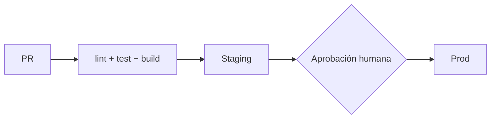

# Despliegue de {{project_name}}

> Regla innegociable: ningún deploy a producción sin aprobación humana explícita.

## Entornos
| Entorno | URL | Rama / disparador | Aprobación | Datos |
|---|---|---|---|---|
| dev | {{…}} | {{…}} | ninguna | ficticios |
| staging | {{…}} | {{…}} | {{…}} | {{…}} |
| prod | {{…}} | {{tag / manual}} | **humana** | reales |

## Plataforma e infraestructura
{{proveedor, servicios, IaC y dónde vive}}

## Pipeline

{{archivos de CI/CD y qué hace cada job}}

## Cómo desplegar
```bash
{{comando o acción para staging}}
{{comando o acción para producción}}
```

## Migraciones de base de datos
- Cuándo se aplican: {{antes/después del deploy, job separado}}
- Patrón: expand → migrate → contract (compatibles con la versión anterior)
- Comando: {{…}}

## Rollback
1. {{paso concreto}}
2. {{paso concreto}}
- Tiempo estimado: {{…}}
- Si hubo migración: {{cómo se revierte o por qué no hace falta}}

## Variables de entorno
| Nombre | dev | staging | prod | Dónde se configura |
|---|---|---|---|---|
| {{VAR}} | ✓ | ✓ | ✓ | {{gestor de secretos}} |

(Solo nombres. Nunca valores.)

## Verificación post-deploy
- Health check: {{endpoint o prueba}}
- Smoke tests: {{…}}
- Logs: {{dónde}} · Métricas: {{dónde}} · Alertas: {{dónde}} (ver [observability.md](observability.md))
- Trazabilidad: busca por `request_id` una petición de los smoke tests y confirma que sus logs
  y eventos de auditoría llegan al destino esperado.

## Riesgos conocidos
<!-- IDs `RD<n>` y correcciones `RD<n>.<letra>`, con el mismo formato que docs/security.md. -->
### RD1 · {{prioridad}} — {{riesgo}}
Correcciones:
- RD1.a {{corrección}} — estado: pendiente
